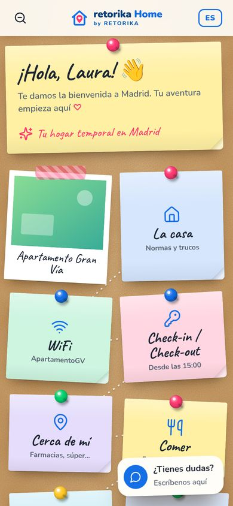
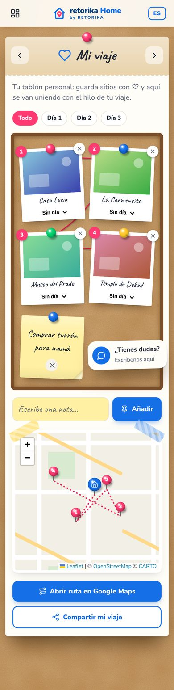
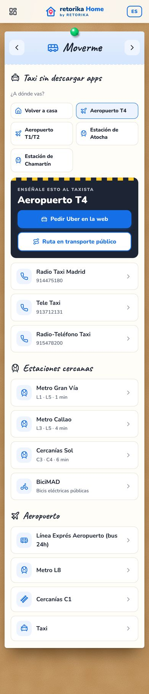
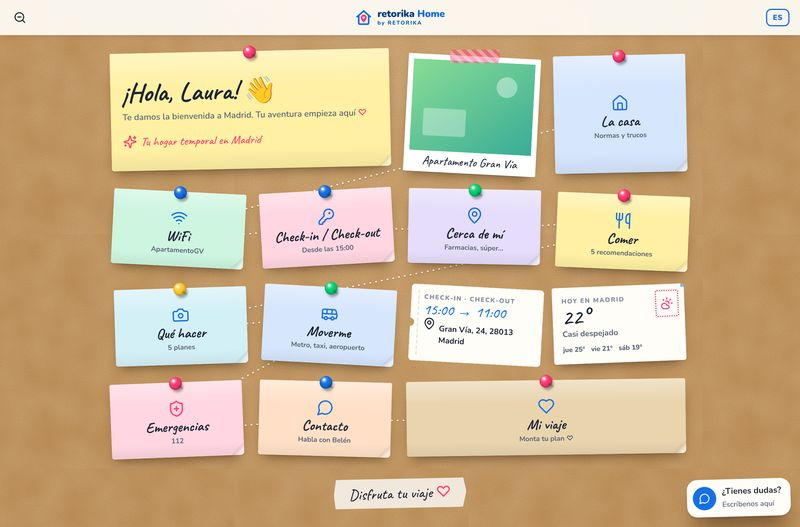
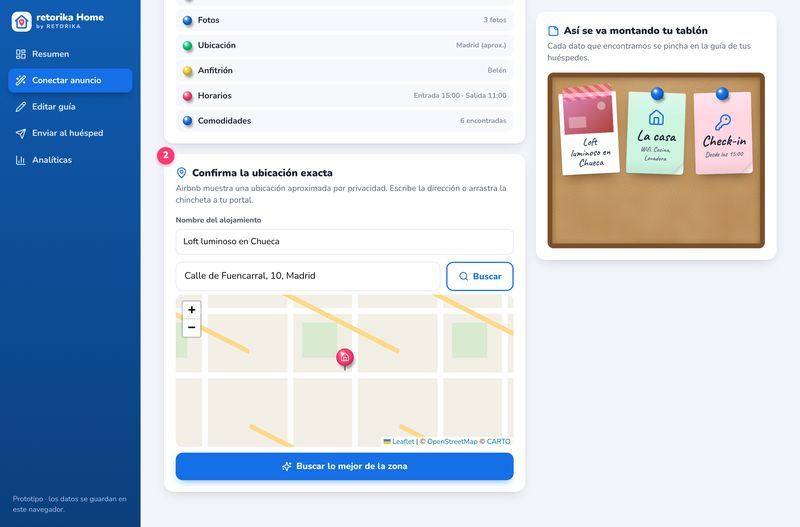

# retorika Home 📌

**Tu estancia. Todo en un clic.** Es una guía digital para huéspedes de Airbnb con estética de **tablón de corcho**: notas adhesivas, chinchetas, polaroids y un hilo rojo que une el viaje. Incluye también un **panel para el propietario**: pega el enlace de su anuncio y la guía se autocompleta.

<p>
  
  
  
</p>



👉 **El concepto completo** (experiencia, decisiones de diseño, taxis, importador de Airbnb, aspectos legales, hoja de ruta y modelo de negocio) está en **[docs/CONCEPTO.md](docs/CONCEPTO.md)**.

## Arrancar

```bash
node server.mjs          # Node 18+, sin npm install
```

- Guía demo: http://localhost:5173/?guide=granvia&g=Laura&in=2026-10-08&out=2026-10-11
- Panel: http://localhost:5173/panel.html

Para tener **valoraciones reales** (restaurantes "mejor valorados"):

```bash
GOOGLE_PLACES_KEY=xxxx node server.mjs
```

Sin clave se usa OpenStreetMap, que es gratis y está ordenado por cercanía.

## Qué hace

**Huésped**
- Tablón animado: las notas caen, las chinchetas se clavan, hay un camino punteado entre notas y de vez en cuando alguna se balancea.
- Al tocar una nota, se levanta y se abre como hoja de detalle.
- Vista general con zoom (botón o pellizco) y "Estás aquí".
- WiFi con QR para conectarse directamente.
- Checklist de salida y recordatorio en el calendario.
- "Cerca de mí" en vivo: mapa con chinchetas, farmacias 24 h, súper, metro…
- ♥ en un sitio lo guarda en **Mi viaje**: polaroids numeradas, hilo rojo, días, notas propias, ruta en Google Maps y opción de compartir.
- **Taxi sin apps**: Uber web con origen y destino ya rellenos, radio-taxi por teléfono, tarjeta "enséñale esto al taxista" y "Volver a casa".
- ES/EN y modo sin conexión (service worker).

**Propietario**
- Pega el enlace de Airbnb y se importan título, fotos, ubicación, anfitrión, horarios y comodidades, mientras el tablón se monta en directo.
- Confirma la ubicación arrastrando la chincheta.
- Recomendaciones automáticas: restaurantes mejor valorados, qué ver, metro y hospital.
- Editor con vista previa en un móvil.
- Enlace personalizado por huésped, mensaje de WhatsApp listo y cartel QR imprimible.
- Analíticas de uso.

## Despliegue
- **Netlify**: el repo ya está preparado (`netlify.toml` + `netlify/functions`). Variable opcional: `GOOGLE_PLACES_KEY`.
- **Hosting estático** (GitHub Pages…): la guía funciona entera. Lo único que necesita servidor es el importador de Airbnb; sin él, el panel ofrece entrar la dirección a mano o probar el ejemplo.

## Estado
Es un prototipo funcional: los datos se guardan en el navegador (`localStorage`). El siguiente paso (base de datos, cuentas, IA…) está en la hoja de ruta de `docs/CONCEPTO.md`.
