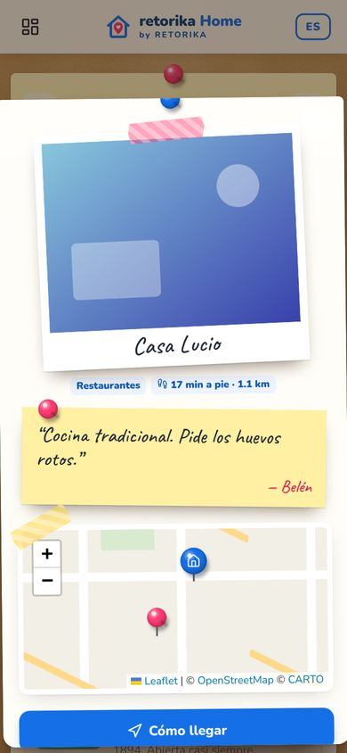
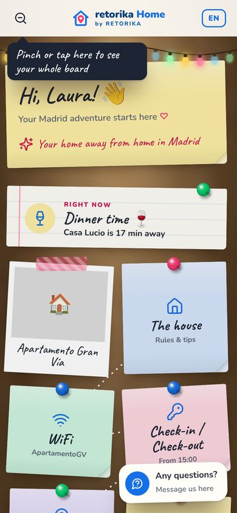
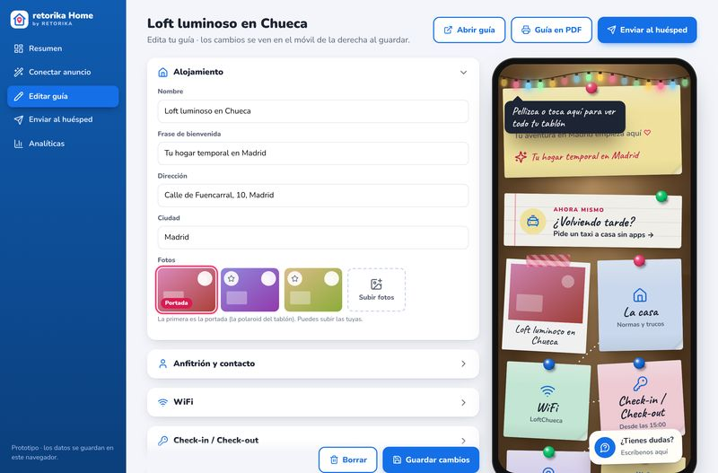

# retorika Home 📌

**Tu estancia. Todo en un clic.** Es una guía digital para huéspedes de Airbnb con estética de **tablón de corcho**: notas adhesivas, chinchetas, polaroids y un hilo rojo que une el viaje. Incluye también un **panel para el propietario**: pega el enlace de su anuncio y la guía se autocompleta.

<p>
  
  
  
  
</p>
<p>
  
</p>
<p>
  
  
</p>

- 👉 **El concepto completo** (experiencia, diseño, taxis sin app, importador de Airbnb, aspectos legales, hoja de ruta y negocio): **[docs/CONCEPTO.md](docs/CONCEPTO.md)**
- 🌙 **Qué se hizo la noche del 7 al 8 de octubre**, tanda por tanda: **[docs/DIARIO-NOCHE.md](docs/DIARIO-NOCHE.md)**

## Arrancar

```bash
node server.mjs          # Node 18+, sin instalar nada
```

| | URL |
|---|---|
| Guía demo | http://localhost:5173/?guide=granvia&g=Laura&in=2026-10-08&out=2026-10-11 |
| Panel del propietario | http://localhost:5173/panel.html |
| Guía imprimible (PDF) | http://localhost:5173/print.html?guide=granvia |
| Probar otra hora / modo noche | añade `&time=22&night=1` a la guía |

**Valoraciones reales** de restaurantes ("mejor valorados"): `GOOGLE_PLACES_KEY=xxxx node server.mjs`. Sin clave se usa OpenStreetMap, que es gratis pero no tiene valoraciones, así que ordena por cercanía.

## Qué hace

**Para el huésped**
- **El tablón**:
  - Las notas caen y las chinchetas se clavan; un camino punteado las une.
  - Al tocar una nota, se levanta y se abre.
  - Pellizcar o tocar 🔍 muestra todo el tablón, con un "Estás aquí".
- **Ahora mismo**: una nota que cambia según la hora, el tiempo y el día (desayuno, plan de tarde, plan a cubierto si llueve, cena, taxi de madrugada, "hoy llegas" o "hoy te vas").
- **Modo noche** con guirnalda de luces, de 21:00 a 7:00.
- **WiFi** con QR para conectarse, lista para el check-out y recordatorio en el calendario.
- **Cerca de mí** en vivo (farmacias 24 h primero, súper, metro…). Si no hay conexión, avisa y deja reintentar.
- **Ficha de cada sitio**: polaroid grande, **nota manuscrita del anfitrión**, mini mapa, cómo llegar y Uber.
- **Mi viaje**:
  - ♥ guarda un sitio y lo pincha en tu propio tablón, con polaroids numeradas e hilo rojo.
  - Se puede repartir por días y escribir notas propias.
  - Se reordena **arrastrando**, y la ruta se puede **ordenar por cercanía**.
  - Abre la ruta en Google Maps.
- **Taxi sin apps**: Uber web con origen y destino ya rellenos, radio-taxi por teléfono, tarjeta "enséñale esto al taxista" y "Volver a casa".
- **¿Tienes dudas?**: encuentra la respuesta dentro de la guía al instante. Si no la sabe, prepara el WhatsApp al anfitrión.
- **5 idiomas** (ES/EN/FR/IT/DE): se elige solo según el móvil del huésped.
- Funciona **sin datos** gracias al service worker.

**Para el propietario**
- **Pega el enlace de Airbnb** y se importan título, fotos, ubicación, anfitrión, horarios y comodidades, mientras el tablón se monta en directo.
- Confirma la ubicación **arrastrando la chincheta**.
- **Recomendaciones automáticas**: restaurantes mejor valorados, qué ver, metro y hospital.
- **Editor con vista previa en un móvil**:
  - Subir fotos y elegir la portada.
  - Foto del anfitrión.
  - Recomendaciones con nota propia, orden y favoritos.
- **Enviar al huésped**: enlace personalizado (nombre y fechas), mensaje de WhatsApp listo, QR y cartel imprimible.
- **Guía en PDF** (A4, 4 páginas), con un QR de ruta para cada sitio.
- **Analíticas**: secciones más vistas y **qué preguntan los huéspedes**. Las preguntas que la guía no supo responder aparecen destacadas.

## Calidad

```bash
npm install          # solo para las pruebas (Playwright, axe-core)
npm test             # 27 pruebas unitarias
npm run test:e2e     # 33 pruebas en navegador real (red simulada)
```

- Las pruebas en navegador recorren la web entera como lo haría una persona.
- Incluyen **accesibilidad con axe-core (0 violaciones)**, **seguridad frente a XSS**, modo sin conexión y el PDF.
- Se ejecutan solas en **GitHub Actions** en cada push.
- `node tools/build-icons.mjs` regenera el paquete de iconos: solo los usados, 25 KB.

## Despliegue
- **Netlify**: el repo ya está preparado (`netlify.toml` + `netlify/functions`). Variable opcional: `GOOGLE_PLACES_KEY`.
- **Hosting estático** (GitHub Pages…): la guía funciona entera. Lo único que necesita servidor es el importador de Airbnb; sin él, el panel ofrece entrar la dirección a mano o probar el ejemplo.

## Estado
Es un **prototipo funcional**: los datos se guardan en el navegador. El siguiente paso es base de datos y cuentas, asistente con IA, traducción automática e integración con las reservas; está en la hoja de ruta de `docs/CONCEPTO.md`.
